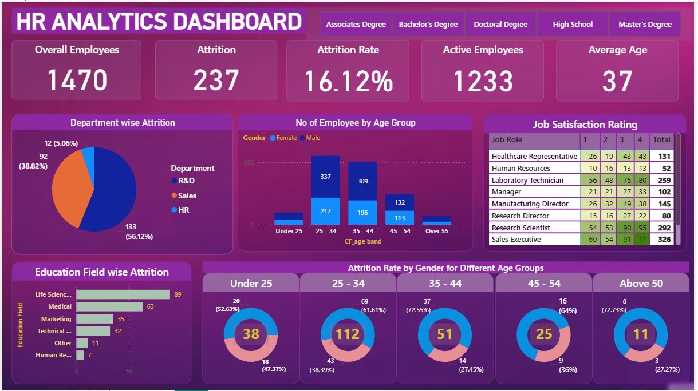

# HR Analytics Dashboard 📊

This project features a fully interactive *Power BI dashboard* designed to analyze key HR metrics such as employee attrition, workforce demographics, and satisfaction levels. 
##  Overview
This project focuses on analyzing HR data to uncover insights about employee attrition, workforce demographics, and job satisfaction. Using Power BI, an interactive dashboard was built to help HR managers and business leaders monitor key metrics such as attrition rate, active employees, average employee age, and department-wise performance.

##  Objectives:
- Identify departments with high attrition rates
- Explore attrition trends by gender, education field, and age group
- Evaluate job satisfaction and work environment ratings
- Present a comprehensive overview of workforce composition

##  Dataset
The dataset contains employee records with details related to demographics, job role, and attrition.  
Key columns include:

- *EmployeeID* – Unique identifier for each employee  
- *Age* – Age of the employee  
- *Gender* – Male/Female  
- *Department* – Department where the employee works (Sales, HR, R&D, etc.)  
- *JobRole* – Specific role of the employee  
- *EducationField* – Background of education (Life Sciences, Medical, Technical, etc.)  
- *MaritalStatus* – Marital status of the employee  
- *Attrition* – Whether the employee left the company (Yes/No)    
- *MonthlyIncome* – Employee’s monthly salary  
📌 Note: This dataset is sample HR data and does not contain any sensitive or personal information.

##  Tools & Technologies
- *Power BI* – For building the interactive HR Analytics dashboard and visualizations  
- *Excel* – Used for initial data exploration and cleaning  
- *DAX (Data Analysis Expressions)* – For creating calculated columns and measures in Power BI  
- *Data Visualization Techniques* – Charts, slicers, filters, and KPIs for interactive reporting

  ##  Methodology
The project was developed using the following steps:

1. *Data Collection*  
   - Used a sample HR dataset containing employee details such as demographics, job role, attrition, and satisfaction levels.

2. *Data Cleaning & Preparation*  
   - Removed duplicates and handled missing values in Excel.  
   - Standardized categorical values (e.g., Department, JobRole, EducationField).  

3. *Data Loading into Power BI*  
   - Imported the dataset into Power BI for further analysis.  
   - Established relationships between different fields (e.g., Department ↔ Attrition).  

4. *Data Transformation*  
   - Applied Power Query for data formatting.  
   - Created calculated columns and measures using *DAX* (e.g., Attrition Rate, Average Age, Average Monthly Income).  

5. *Dashboard Design*  
   - Built interactive charts, KPIs, and slicers for filtering by Department, Gender, Education, and Age.  
   - Designed multiple views for HR managers to analyze attrition trends, demographics, and job satisfaction

##  Key Insights:
-  *Overall Attrition Rate*: 16.12%
-  *Highest Attrition*:
  - Department: HR & Sales
  - Education Field: Human Resources
-  *Gender Distribution*: Visual breakdown of attrition by gender
-  *Education Fields*: Compare attrition across various education domains
-  *Age Group Analysis*: Younger age groups show higher turnover
-  *Job Satisfaction Ratings*: Highlights roles with low/high satisfaction

✅ *Key KPIs at a Glance*:
  - Total Employees
  - Employees Who Left
  - Average Age
  - Number of Departments
  - Count of Education Fields
    
## 📈 Dashboard
The HR Analytics Dashboard is designed to provide a clear understanding of employee attrition and workforce demographics.  

- The *top KPIs* highlight the overall employee count, active employees, attrition count, and attrition rate, giving HR managers a quick snapshot of workforce health.  
- The *attrition analysis visuals* explain which departments, education fields, and job roles are experiencing the highest turnover.  
- The *demographic charts* show how factors such as age, gender, and marital status influence attrition patterns.  
- The *income and satisfaction analysis* reveals how salary levels, job satisfaction, and work-life balance are linked to attrition.  
- By combining these insights, the dashboard helps HR teams identify at-risk employee groups and take proactive measures to improve retention.

## 🖼 Dashboard Preview:

## 📂 Files Included:
- HR Analytics Dashboard.pbix – Power BI dashboard file
- HR_Analytics.png – Screenshot of final dashboard
- HR Data.csv – Cleaned sample HR dataset

## 🧭 How to Explore:
1. Download the .pbix file from this repository
2. Open it in *Power BI Desktop*
3. Use filters, slicers, and charts to explore attrition patterns and employee demographics

## 📝 Disclaimer:
> This project uses publicly available or synthetic HR data for demonstration and learning purposes only.  
> No real employee data is used.

# 👩‍💻 Author
*Gaurangi Dangat*  
📊Aspiring Data Analyst  

